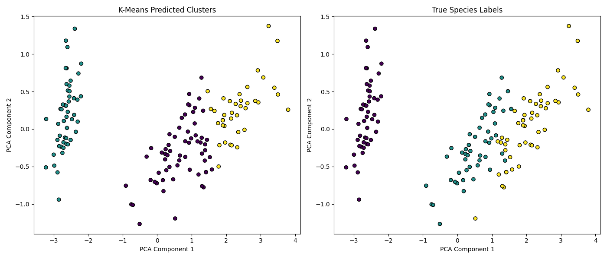

# 🌸 Iris Flower Clustering Project

Week 3 mini-project for the **SkillNexis ML/AI course** — Unsupervised Learning using K-Means Clustering with PCA-based visualization on the classic Iris dataset.
## 📊 Result Visualization



*Left: K-Means predicted clusters | Right: True species labels*

## 📁 Dataset

Built-in Iris dataset from scikit-learn (150 samples, 4 features: sepal length, sepal width, petal length, petal width). No manual download needed — it loads automatically via `sklearn.datasets.load_iris()`.
## 🔍 Steps
1. Load dataset (`sklearn.datasets.load_iris`)
2. Apply K-Means clustering (k=3)
3. Reduce dimensions to 2D using PCA for visualization
4. Plot predicted clusters vs true species labels side-by-side
5. Evaluate clustering using a confusion matrix

## ✅ Results
- PCA captured **97.77%** of total variance in just 2 components
- Setosa species was perfectly separated by clustering
- Versicolor and Virginica showed some natural overlap (expected, as they are biologically similar species)

## 🛠️ Tech Stack
`Python` `scikit-learn` `Matplotlib` `PCA` `K-Means`

## 🚀 How to Run
```bash
pip install matplotlib scikit-learn
python iris_clustering_project.py
```
